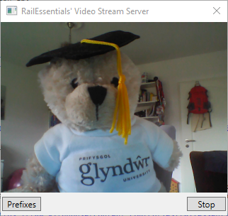
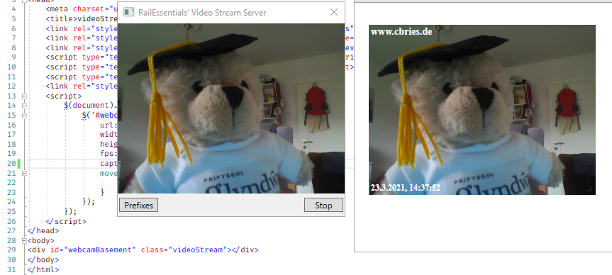

# WebCam/Video Stream Server

`videoStreamServer` is a WebCam/Video "streaming" server to provide fiddle yard surveilance for the software project `RailEssentials` (see [GitHub Repository](https://github.com/cbries/railessentials)). It uses [`Emgu CV`](https://github.com/emgucv/emgucv) to retrieve WebCam data and provides the data via `HttpListener`  (see [Microsoft](https://docs.microsoft.com/en-us/dotnet/api/system.net.httplistenerprefixcollection.add?view=net-5.0)).

## Quick Start for Developer

- install [`VisualStudio 2019`](https://visualstudio.microsoft.com/vs/) or the old variant [`VisualStudio 2017`](https://visualstudio.microsoft.com/vs/older-downloads/)
- clone the `videoStreamServer` repository `git clone https://github.com/cbries/videoStreamServer.git` or download the latest archive [master.zip](https://github.com/cbries/videoStreamServer/archive/master.zip)
- open the solution `videoStreamServer.sln`
- set `videoStreamServer` as **_Startup Project_**
- click `F5` or call `VisualStudio Toolbar / Debug / Start Debugging`
- Note: it is important to build a `x86` variant (default)

## Configuration

Open the file `videoStreamServer\videoStreamServer.json` in your editor of choice. 
The default configuration is:

```json
{
  "WebServer": {
    "Prefixes": [
      "http://localhost:8088/",
      "http://127.0.0.1:8088/"
    ]
  }
}
```

The `prefixes` are the addresses for stream server to listen for requests (see [Microsoft](https://docs.microsoft.com/en-us/dotnet/api/system.net.httplistenerprefixcollection.add?view=net-5.0)). In most cases the default can be used.

## On Air

To start the streaming process, just doubleclick `videoStreamServer\videoStreamServer.exe`.
A small window will open and in most cases an image will be shown, when a webcam is attached to your computer.



## View Stream

### Includes:

Include `jquery`, `jqueryUI`, and `videoStream.js`:

```html
    <link rel="stylesheet" href="libs/jquery-ui.min.css" type="text/css">
    <link rel="stylesheet" href="libs/jquery-ui.structure.min.css" type="text/css">
    <link rel="stylesheet" href="libs/jquery-ui.theme.min.css" type="text/css">
    <script type="text/javascript" src="libs/jquery-2.1.0.min.js"></script>		
    <script type="text/javascript" src="libs/jquery-ui.min.js"></script>
    <script type="text/javascript" src="videoStream.js"></script>
```

### Provide rendering container:

Add any control to be used for the stream:

```html
<div id="webcamBasement" class="videoStream"></div>
```

### Call `videoStream()` for initialization:

Just initialize the container for using the stream:

```javascript
$(document).ready(function () {
  $('#webcamBasement').videoStream({
    url: "http://localhost:8088/",
    width: 320,
    height: 240,
    fps: 5,
    caption: "www.cbries.de",
    moved: function(position) {
      console.log(position);
    }
  });
});
```

### Result

If `videoStreamServer` has been started the stream should be available by just opening the example file `jqueryVideoStream/videoStream.html`.

The container is **draggable** and **resizable**.



## Usage in `RailEssentials`

The `videoStreamServer` was implemented for usage in `RailEssentials` and is used everyday during playtime with the model railway.

